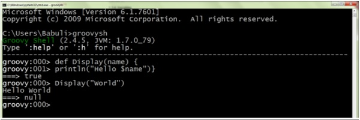

## 安装

下载SDK包（apache-groovy-sdk-2.5.8.zip）

## 语法基础

| as     | assert  | break      | case       |
| ------ | :------ | ---------- | ---------- |
| catch  | class   | const      | continue   |
| def    | default | do         | else       |
| enum   | extends | FALSE      | Finally    |
| for    | goto    | if         | implements |
| import | in      | instanceof | interface  |
| new    | pull    | package    | return     |
| super  | switch  | this       | throw      |
| throws | trait   | TRUE       | try        |
| while  |         |            |            |

## 数据类型

### 内置数据类型

- **byte** -这是用来表示字节值。例如2。
- **short** -这是用来表示一个短整型。例如10。
- **int** -这是用来表示整数。例如1234。
- **long** -这是用来表示一个长整型。例如10000090。
- **float** -这是用来表示32位浮点数。例如12.34。
- **double** -这是用来表示64位浮点数，这些数字是有时可能需要的更长的十进制数表示。例如12.3456565。
- **char** -这定义了单个字符文字。例如“A”。
- **Boolean** -这表示一个布尔值，可以是true或false。
- **String** -这些是以字符串的形式表示的文本。例如，“Hello World”的。

### 数字类

类型除了基本类型，还允许以下对象类型（有时称为包装器类型）-

- java.lang.Byte
- java.lang.Short
- java.lang.Integer
- java.lang.Long
- java.lang.Float
- java.lang.Double

此外，以下类可用于支持高精度计算 -

| 名称                 | 描述                             | 例如  |
| -------------------- | -------------------------------- | ----- |
| java.math.BigInteger | 不可变的任意精度的有符号整数数字 | 30克  |
| java.math.BigDecimal | 不可变的任意精度的有符号十进制数 | 3.5克 |

## 变量

大小写敏感，除了上面的数据类型，还可以使用def定义

## 运算符

Groovy中有以下类型的运算符 -

- 算术运算符
- 关系运算符
- 逻辑运算符
- 位运算符
- 赋值运算符

### 算术运算符

Groovy语言支持正常的算术运算符任何语言。以下是在Groovy中可用的算术运算符 -

| **运算符** | **描述**                      | **例子**                   |
| ---------- | ----------------------------- | -------------------------- |
| +          | 两个操作数的加法              | 1 + 2 将得到 3             |
| -          | 第一第二操作数相减            | 2 - 1 将得到 1             |
| *          | 两个操作数的乘法              | 2 * 2 将得到4              |
| /          | 两个操作数的除法              | 3/2 将得到 1.5             |
| ％         | 取模运算                      | 3％2 将得到 1              |
| ++         | 自增运算，在自身值的基础上加1 | INT X = 5;X ++;X 将得到 6  |
| --         | 自减运算,在自身值的基础上减1  | INT X = 5;X - -;X 将得到 4 |


### 关系运算符

关系运算符允许对象的比较。以下是在Groovy中可用的关系运算符 -

| 运算符 | 描述                                   | 例子               |
| ------ | -------------------------------------- | ------------------ |
| ==     | 测试两个对象之间是否相等               | 2 == 2 将得到 true |
| !=     | 测试两个对象之间是否不等               | 3 != 2 将得到 true |
| <      | 检查是否左边的对象是小于右边的对象。   | 2 < 3 将得到 true  |
| <=     | 检查是否向左对象是小于或等于右边的对象 | 2 <= 3 将得到 true |
| >      | 检查是否左边的对象比右边的对象大。     | 3 > 2 将得到 true  |
| >=     | 检查是否向左对象大于或等于右边的对象。 | 3>= 2 将得到 true  |

### 逻辑运算符

逻辑运算符用于计算布尔表达式。以下是在Groovy中提供的逻辑运算符 -

[显示示例](https://www.w3cschool.cn/groovy/groovy_logical_operators.html)

| 运算符 | 描述             | 例子                     |
| ------ | ---------------- | ------------------------ |
| &&     | 这是逻辑“与”运算 | true && true 得到 true   |
| \|\|   | 这是逻辑“或”运算 | true \|\| true 得到 true |
| ！     | 这是逻辑“非”运算 | !true 得到 false         |

### 位运算符

Groovy中提供了四个位运算符。以下是在Groovy中可用的位运算符 -

| 运算符 |            描述            |
| :----: | :------------------------: |
|   ＆   |       这是位“与”运算       |
|   \|   |      这是按位“或”运算      |
|   ^    | 这是按位“异或”或异或运算符 |
|   〜   |      这是按位反运算符      |

这里是显示这些运算符的真值表。

|  p   |  q   | p＆Q | p \| q | p ^ Q |
| :--: | :--: | :--: | :----: | :---: |
|  0   |  0   |  0   |   0    |   0   |
|  0   |  1   |  0   |   1    |   1   |
|  1   |  1   |  1   |   1    |   0   |
|  1   |  0   |  0   |   1    |   1   |

### 赋值运算符

Groovy语言也提供了赋值操作符。以下是在Groovy提供的赋值运算符 -

| 运算符 | 描述                      | 例子                      |
| ------ | ------------------------- | ------------------------- |
| +=     | A += B 等价于 A = A+B     | DEF A = 5A += 3输出将是8  |
| -=     | A -= B 等价于 A = A-B     | DEF A = 5A -= 3输出将是2  |
| *=     | A *= B 等价于 A= A*B      | DEF A = 5A *= 3输出将是15 |
| /=     | A /= B 等价于 A = A/B     | DEF A = 6A /= 3输出将是2  |
| (%)=   | A (%)= B 等价于 A = A % B | DEF A = 5A %= 3输出将是2  |

### 范围运算符

Groovy支持范围的概念，并在..符号的帮助下提供范围运算符的符号。下面给出了范围运算符的一个简单示例。

```
def range = 0..5 
```

这只是定义了一个简单的整数范围，存储到一个局部变量称为范围内的下限为0和上限为5。

以下代码段显示了如何使用各种运算符。

```groovy
class Example { 
   static void main(String[] args) { 
      def range = 5..10; 
      println(range); 
      println(range.get(2)); 
   } 
}
```

当我们运行上面的程序，我们会得到以下结果 -

从println语句中，可以看到显示在range语句中定义的整个数字范围。

get语句用于从定义的范围中获取一个对象，它将索引值作为参数。

```
[5, 6, 7, 8, 9, 10] 
7
```

### 运算符优先级

下表按优先级顺序列出了所有groovy运算符

| 运算符                                               | 名称                    |
| ---------------------------------------------------- | ----------------------- |
| ++ - + -                                             | 预增/减，一元加，一元减 |
| * / ％                                               | 乘法，除法，取模        |
| + -                                                  | 加法，减法              |
| ==！= <=>                                            | 等于，不等于，比较      |
| ＆                                                   | 二进制/位运算符与       |
| ^                                                    | 二进制/位异或           |
| \|                                                   | 二进制/按位或           |
| &&                                                   | 逻辑和                  |
| \|\|                                                 | 逻辑或                  |
| = ** = * = / =％= + = - = << = >> = >>> = = ^ = \| = | 各种赋值运算符          |

## 循环

while for 与Java一致

### for-in

**for-in** 语句用于遍历一组值。**for-in** 语句通常以以下方式使用。

```groovy
for(variable in range) { 
   statement #1 
   statement #2 
   … 
}
```

下图显示了此循环的图解说明。


以下是for-in语句的示例 -

```groovy
class Example { 
   static void main(String[] args) { 
      int[] array = [0,1,2,3]; 
		
      for(int i in array) { 
         println(i); 
      } 
   } 
}
```

在上面的例子中，我们首先初始化一个具有0,1,2和3的4个值的整数数组。然后我们使用for循环语句首先定义一个变量i，然后遍历数组中的所有整数 并相应地打印值。上面的代码的输出将是 -

```
0 
1 
2 
3
```

**for-in** 语句也可用于循环范围。以下示例说明如何完成此操作。

```groovy
class Example {
   static void main(String[] args) {
	
      for(int i in 1..5) {
         println(i);
      }
		
   } 
} 
```

在上面的例子中，我们实际上循环了从1到5定义的范围，并打印该范围中的每个值。上面的代码的输出将是 -

```
1 
2 
3 
4 
5 
```

**for-in** 语句也可用于循环访问Map。以下示例说明如何完成此操作。

```groovy
class Example {
   static void main(String[] args) {
      def employee = ["Ken" : 21, "John" : 25, "Sally" : 22];
		
      for(emp in employee) {
         println(emp);
      }
   }
}
```

在上面的例子中，我们实际上循环通过一个映射，它有一组定义的键值条目。上面的代码的输出将是 -

```
Ken = 21 
John = 25 
Sally = 22 
```

### 循环控制语句

break 与 continue 用法与Java一致

## 条件语句

|                          语句和描述                          |
| :----------------------------------------------------------: |
| [if语句](https://www.w3cschool.cn/groovy/groovy_if_statement.html)这个语句的一般工作是首先在if语句中计算一个条件。如果条件为真，它然后执行语句。 |
| [if / else语句](https://www.w3cschool.cn/groovy/groovy_if_else_statement.html)这个语句的一般工作是首先在if语句中计算一个条件。如果条件为真，则其后执行语句，并在else条件之前停止并退出循环。如果条件为假，则执行else语句块中的语句，然后退出循环。 |
| [嵌套if语句](https://www.w3cschool.cn/groovy/groovy_nested_if_statement.html)i有时需要有多个if语句嵌入在彼此内部。 |
| [Switch语句](https://www.w3cschool.cn/groovy/groovy_switch_statement.html)有时，嵌套的if-else语句是如此常见，并且经常使用，因此设计了一个更容易的语句，称为switch语句。 |
| [嵌套switch语句](https://www.w3cschool.cn/groovy/groovy_nested_switch_statement.html)switch也可以多层嵌套。 |

语法结构与Java一致

## 方法

与Java相比没有default级别的方法，不写默认public

```groovy
def methodName(){
    
}
```

参数

```groovy
def MehodName(p1,p2,p3){

}
```

默认参数

```groovy
def MethodName(p1,p2=0,p3=0){
	//不指定的时候给予默认值，传参没有默认的必传，有默认值的随意
}
```

返回值与Java一致

本地和外部参数与Java一致

方法属性，可以使用this,来访问它的实例成员

## I/O

```groovy
class IOTest {
    static void main(String[] args) {
        new File("D:\\Code\\GroovyTest\\src\\Example.txt").eachLine {
            line -> println "line:$line"
        }
        File file = new File("D:\\Code\\GroovyTest\\src\\Example.txt")
        println file.text;
        new File("D:\\Code\\GroovyTest\\src\\", "Example.txt").withWriter('UTF-8') {
            writer -> writer.writeLine 'Hello World'
        }
        // 写入文件
        File writerFile = new File("D:\\Code\\GroovyTest\\src\\Example.txt")
        println writerFile.text;

        // 文件长度
        println "The File ${writerFile.absolutePath} has ${file.length()} bytes ";

        // 测试文件是否是目录
        println "File? ${file.isFile()}"
        println "Directory? ${file.isDirectory()}"

        // 创建目录
        def srcDirectory = new File('D:\\Code\\GroovyTest\\srcDirectory')
        srcDirectory.mkdir()
        srcDirectory.deleteOnExit()
        // 复制文件
        def dst = new File("D:\\Code\\GroovyTest\\src\\Example2.txt")
        dst << file.text
        // 获取目录内容
        def rootFiles = new File("src").listRoots();
        rootFiles.each {
            rootFile ->println rootFile.absolutePath
        }
       // showDirectorFiles(".")
        showDirectorAndFile(".")
    }
    // 显示文件夹里的文件
    static void showDirectorFiles(def path){
        new  File(path).eachFile (){
            file->println( file.getAbsoluteFile())
        }
    }
    // 递归显示所有
    static void showDirectorAndFile(def path){
        new File(path).eachFileRecurse (){
            file -> println(file.getAbsolutePath())
        }
    }
}
```

## 数字方法

由于Groovy中的Numbers表示为类，以下是可用的方法列表。

| 序号 | 方法和描述                                                   |
| ---- | :----------------------------------------------------------- |
| 1    | [xxxValue（）](https://www.w3cschool.cn/groovy/groovy_xxxvalue.html)此方法接受Number作为参数，并基于调用的方法返回基本类型。 |
| 2    | [compareTo()](https://www.w3cschool.cn/groovy/groovy_compareto.html)compareTo方法是使用比较一个数字与另一个数字。如果要比较数字的值，这是有用的。 |
| 3    | [equals()](https://www.w3cschool.cn/groovy/groovy_equals.html)该方法确定调用方法的Number对象是否等于作为参数传递的对象。 |
| 4    | [valueOf()](https://www.w3cschool.cn/groovy/groovy_valueof.html)valueOf方法返回保存所传递的参数的值的相关Number对象。 |
| 5    | [toString()](https://www.w3cschool.cn/groovy/groovy_tostring.html)该方法用于获取表示Number对象的值的String对象。 |
| 6    | [parseInt()](https://www.w3cschool.cn/groovy/groovy_parseint.html)此方法用于获取某个String的原始数据类型。 parseXxx（）是一个静态方法，可以有一个参数或两个参数。 |
| 7    | [abs()](https://www.w3cschool.cn/groovy/groovy_abs.html)该方法给出了参数的绝对值。参数可以是int，float，long，double，short，byte。 |
| 8    | [ceil()](https://www.w3cschool.cn/groovy/groovy_ceil.html)方法ceil给出大于或等于参数的最小整数。 |
| 9    | [floor()](https://www.w3cschool.cn/groovy/groovy_floor.html)方法floor给出小于或等于参数的最大整数。 |
| 10   | [rint()](https://www.w3cschool.cn/groovy/groovy_rint.html)方法rint返回值最接近参数的整数。 |
| 11   | [round()](https://www.w3cschool.cn/groovy/groovy_round.html)方法round返回最接近的long或int，由方法返回类型给出。 |
| 12   | [min()](https://www.w3cschool.cn/groovy/groovy_min.html)该方法给出两个参数中较小的一个。参数可以是int，float，long，double。 |
| 13   | [max()](https://www.w3cschool.cn/groovy/groovy_max.html)该方法给出了两个参数的最大值。参数可以是int，float，long，double。 |
| 14   | [exp()](https://www.w3cschool.cn/groovy/groovy_exp.html)该方法返回自然对数e的底数为参数的幂。 |
| 15   | [log()](https://www.w3cschool.cn/groovy/groovy_log.html)该方法返回参数的自然对数。 |
| 16   | [pow()](https://www.w3cschool.cn/groovy/groovy_pow.html)该方法返回第一个参数的值增加到第二个参数的幂。 |
| 17   | [sqrt()](https://www.w3cschool.cn/groovy/groovy_sqrt.html)该方法返回参数的平方根。 |
| 18   | [sin()](https://www.w3cschool.cn/groovy/groovy_sin.html)该方法返回指定double值的正弦值。 |
| 19   | [cos()](https://www.w3cschool.cn/groovy/groovy_cos.html)该方法返回指定double值的余弦值。 |
| 20   | [tan()](https://www.w3cschool.cn/groovy/groovy_tan.html)该方法返回指定double值的正切值。 |
| 21   | [asin()](https://www.w3cschool.cn/groovy/groovy_asin.html)该方法返回指定double值的反正弦值。 |
| 22   | [acos()](https://www.w3cschool.cn/groovy/groovy_acos.html)该方法返回指定double值的反余弦值。 |
| 23   | [atan()](https://www.w3cschool.cn/groovy/groovy_atan.html)该方法返回指定double值的反正切。 |
| 24   | [atan2()](https://www.w3cschool.cn/groovy/groovy_atan2.html)该方法将直角坐标（x，y）转换为极坐标（r，theta），并返回theta。 |
| 25   | [parseInt（）](https://www.w3cschool.cn/groovy/groovy_numbers_parseint.html)该方法将参数值转换为度。 |
| 26   | [radian()](https://www.w3cschool.cn/groovy/groovy_radian.html)该方法将参数值转换为弧度。 |
| 27   | [random()](https://www.w3cschool.cn/groovy/groovy_random.html)该方法用于生成介于0.0和1.0之间的随机数。范围是：0.0 = <Math.random <1.0。通过使用算术可以实现不同的范围。 |

## 字符串

Groovy提供了多种表示String字面量的方法。 Groovy中的字符串可以用单引号（'），双引号（“）或三引号（”“”）括起来。此外，由三重引号括起来的Groovy字符串可以跨越多行。

### 字符串索引

Groovy中的字符串是字符的有序序列。字符串中的单个字符可以通过其位置访问。这由索引位置给出。

字符串索引从零开始，以小于字符串长度的一个结束。 Groovy还允许负索引从字符串的末尾开始计数。

以下是Groovy中字符串索引的使用示例 -

```groovy
class Example { 
   static void main(String[] args) { 
      String sample = "Hello world"; 
      println(sample[4]); // Print the 5 character in the string
		
      //Print the 1st character in the string starting from the back 
      println(sample[-1]); 
      println(sample[1..2]);//Prints a string starting from Index 1 to 2 
      println(sample[4..2]);//Prints a string starting from Index 4 back to 2 
      
   } 
}
```

当我们运行上面的程序，我们将得到以下结果 -

```
o 
d 
el 
oll 
```

### 基本字符串操作

首先让我们学习groovy中的基本字符串操作。它们在下面给出。

| 序号 | 字符串操作和描述                                             |
| ---- | :----------------------------------------------------------- |
| 1    | [Concatenation of two strings](https://www.w3cschool.cn/groovy/groovy_concatenation_of_two_strings.html)字符串的串联可以通过简单的'+'运算符来完成。 |
| 2    | [String Repetition](https://www.w3cschool.cn/groovy/groovy_string_repetition.html)字符串的重复可以通过简单的'*'运算符完成。 |
| 3    | [String Length](https://www.w3cschool.cn/groovy/groovy_string_length.html)由字符串的length（）方法确定的字符串的长度。 |

### 字符串方法

这里是String类支持的方法列表。

| 序号 | 方法和描述                                                   |
| ---- | :----------------------------------------------------------- |
| 1    | [center()](https://www.w3cschool.cn/groovy/groovy_center.html)返回一个新的长度为numberOfChars的字符串，该字符串由左侧和右侧用空格字符填充的收件人组成。 |
| 2    | [compareToIgnoreCase()](https://www.w3cschool.cn/groovy/groovy_comparetoignorecase.html)按字母顺序比较两个字符串，忽略大小写差异。 |
| 3    | [concat()](https://www.w3cschool.cn/groovy/groovy_concat.html)将指定的String连接到此String的结尾。 |
| 4    | [eachMatch()](https://www.w3cschool.cn/groovy/groovy_eachmatch.html)处理每个正则表达式组（参见下一节）匹配的给定String的子字符串。 |
| 5    | [endsWith()](https://www.w3cschool.cn/groovy/groovy_endswith.html)测试此字符串是否以指定的后缀结尾。 |
| 6    | [equalsIgnoreCase()](https://www.w3cschool.cn/groovy/groovy_equalsignorecase.html)将此字符串与另一个字符串进行比较，忽略大小写注意事项。 |
| 7    | [getAt()](https://www.w3cschool.cn/groovy/groovy_getat.html)它在索引位置返回字符串值 |
| 8    | [indexOf()](https://www.w3cschool.cn/groovy/groovy_indexof.html)返回此字符串中指定子字符串第一次出现的索引。 |
| 9    | [matches()](https://www.w3cschool.cn/groovy/groovy_matches.html)它输出字符串是否匹配给定的正则表达式。 |
| 10   | [minus()](https://www.w3cschool.cn/groovy/groovy_minus.html)删除字符串的值部分。 |
| 11   | [next()](https://www.w3cschool.cn/groovy/groovy_next.html)此方法由++运算符为String类调用。它增加给定字符串中的最后一个字符。 |
| 12   | [padLeft（）](https://www.w3cschool.cn/groovy/groovy_padleft.html)填充字符串，并在左边附加空格。 |
| 13   | [padRight()](https://www.w3cschool.cn/groovy/groovy_padright.html)填充字符串，并在右边附加空格。 |
| 14   | [plus()](https://www.w3cschool.cn/groovy/groovy_plus.html)追加字符串 |
| 15   | [previous()](https://www.w3cschool.cn/groovy/groovy_previous.html)此方法由CharSequence的 - 运算符调用。 |
| 16   | [replaceAll（）](https://www.w3cschool.cn/groovy/groovy_replaceall.html)通过对该文本的关闭结果替换捕获的组的所有出现。 |
| 17   | [center()](https://www.w3cschool.cn/groovy/groovy_strings_center.html)创建一个与此String相反的新字符串。 |
| 18   | [split()](https://www.w3cschool.cn/groovy/groovy_split.html)将此String拆分为给定正则表达式的匹配项。 |
| 19   | [subString()](https://www.w3cschool.cn/groovy/groovy_substring.html)返回一个新的String，它是此String的子字符串。 |
| 20   | [toUpperCase()](https://www.w3cschool.cn/groovy/groovy_touppercase.html)将此字符串中的所有字符转换为大写。 |
| 21   | [toLowerCase()](https://www.w3cschool.cn/groovy/groovy_tolowercase.html)将此字符串中的所有字符转换为小写。 |

## 范围

范围是指定值序列的速记。范围由序列中的第一个和最后一个值表示，Range可以是包含或排除。包含范围包括从第一个到最后一个的所有值，而独占范围包括除最后一个之外的所有值。这里有一些范例文字的例子 -

- 1..10 - 包含范围的示例
- 1 .. <10 - 独占范围的示例
- 'a'..'x' - 范围也可以由字符组成
- 10..1 - 范围也可以按降序排列
- 'x'..'a' - 范围也可以由字符组成并按降序排列。

以下是可用于范围的各种方法。

| 序号 | 方法和描述                                                   |
| ---- | :----------------------------------------------------------- |
| 1    | [contains()](https://www.w3cschool.cn/groovy/groovy_contains.html)检查范围是否包含特定值 |
| 2    | [get()](https://www.w3cschool.cn/groovy/groovy_get.html)返回此范围中指定位置处的元素。 |
| 3    | [getFrom()](https://www.w3cschool.cn/groovy/groovy_getfrom.html)获得此范围的下限值。 |
| 4    | [getTo()](https://www.w3cschool.cn/groovy/groovy_getto.html)获得此范围的上限值。 |
| 5    | [isReverse()](https://www.w3cschool.cn/groovy/groovy_isreverse.html)这是一个反向的范围，反向迭代 |
| 6    | [size()](https://www.w3cschool.cn/groovy/groovy_size.html)返回此范围的元素数。 |
| 7    | [subList()](https://www.w3cschool.cn/groovy/groovy_sublist.html)返回此指定的fromIndex（包括）和toIndex（排除）之间的此范围部分的视图 |

## 列表

列表是用于存储数据项集合的结构。在Groovy中，List保存了一系列对象引用。List中的对象引用占据序列中的位置，并通过整数索引来区分。列表文字表示为一系列用逗号分隔并用方括号括起来的对象。

要处理列表中的数据，我们必须能够访问各个元素。 Groovy列表使用索引操作符[]索引。列表索引从零开始，这指的是第一个元素。

以下是一些列表的示例 -

- [11，12，13，14] - 整数值列表
- ['Angular'，'Groovy'，'Java'] - 字符串列表
- [1，2，[3，4]，5] - 嵌套列表
- ['Groovy'，21，2.11] - 异构的对象引用列表
- [] - 一个空列表

在本章中，我们将讨论Groovy中可用的列表方法。

| 序号 | 方法和描述                                                   |
| ---- | :----------------------------------------------------------- |
| 1    | [add()](https://www.w3cschool.cn/groovy/groovy_add.html)将新值附加到此列表的末尾。 |
| 2    | [contains()](https://www.w3cschool.cn/groovy/groovy_lists_contains.html)如果此列表包含指定的值，则返回true。 |
| 3    | [get()](https://www.w3cschool.cn/groovy/groovy_lists_get.html)返回此列表中指定位置的元素。 |
| 4    | [isEmpty()](https://www.w3cschool.cn/groovy/groovy_isempty.html)如果此列表不包含元素，则返回true |
| 5    | [minus()](https://www.w3cschool.cn/groovy/groovy_lists_minus.html)创建一个由原始元素组成的新列表，而不是集合中指定的元素。 |
| 6    | [plus()](https://www.w3cschool.cn/groovy/groovy_lists_plus.html)创建由原始元素和集合中指定的元素组成的新列表。 |
| 7    | [pop()](https://www.w3cschool.cn/groovy/groovy_pop.html)从此列表中删除最后一个项目 |
| 8    | [remove()](https://www.w3cschool.cn/groovy/groovy_remove.html)删除此列表中指定位置的元素。 |
| 9    | [reverse()](https://www.w3cschool.cn/groovy/groovy_reverse.html)创建与原始列表的元素相反的新列表 |
| 10   | [size()](https://www.w3cschool.cn/groovy/groovy_lists_size.html)获取此列表中的元素数。 |
| 11   | [sort()](https://www.w3cschool.cn/groovy/groovy_sort.html)返回原始列表的排序副本。 |

## 映射

映射（也称为关联数组，字典，表和散列）是对象引用的无序集合。Map集合中的元素由键值访问。 Map中使用的键可以是任何类。当我们插入到Map集合中时，需要两个值：键和值。

以下是一些映射的例子 -

- ['TopicName'：'Lists'，'TopicName'：'Maps'] - 具有TopicName作为键的键值对的集合及其相应的值。
- [：] - 空映射。

在本章中，我们将讨论Groovy中可用的映射方法。

| 序号 | 方法和描述                                                   |
| ---- | :----------------------------------------------------------- |
| 1    | [containsKey()](https://www.w3cschool.cn/groovy/groovy_containskey.html)此映射是否包含此键？ |
| 2    | [get()](https://www.w3cschool.cn/groovy/groovy_maps_get.html)查找此Map中的键并返回相应的值。如果此映射中没有键的条目，则返回null。 |
| 3    | [keySet()](https://www.w3cschool.cn/groovy/groovy_keyset.html)获取此映射中的一组键。 |
| 4    | [put()](https://www.w3cschool.cn/groovy/groovy_put.html)将指定的值与此映射中的指定键相关联。如果此映射先前包含此键的映射，则旧值将替换为指定的值。 |
| 5    | [size()](https://www.w3cschool.cn/groovy/groovy_maps_size.html)返回此地图中的键值映射的数量。 |
| 6    | [values()](https://www.w3cschool.cn/groovy/groovy_values.html)返回此地图中包含的值的集合视图。 |

## 日期和时间

类Date表示特定的时刻，具有毫秒精度。 Date类有两个构造函数，如下所示。

### Date()

### 句法

```
public Date()
```

**参数** -无。

**返回值**

分配一个Date对象并初始化它，以便它表示分配的时间，以最近的毫秒为单位。

### 例子

下面是一个使用这个方法的例子 -

```groovy
class Example { 
   static void main(String[] args) { 
      Date date = new Date(); 
      
      // display time and date using toString() 
      System.out.println(date.toString()); 
   } 
} 
```

当我们运行上面的程序，我们将得到以下结果。以下输出将为您提供当前日期和时间 -

```
Thu Dec 10 21:31:15 GST 2015
```

### Date (长毫秒)

### 句法

```
public Date(long millisec)
```

**参数**

毫秒 - millisecconds的数量，因为标准的基准时间指定。

**返回值** -分配一个Date对象并将其初始化以表示自标准基准时间（称为“该历元”，即1970年1月1日，00:00:00 GMT）起指定的毫秒数。

### 例子

下面是一个使用这个方法的例子 -

```groovy
class Example {
   static void main(String[] args) {
      Date date = new Date(100);
      
      // display time and date using toString()
      System.out.println(date.toString());
   } 
}
```

当我们运行上面的程序，我们将得到以下结果 -

```
Thu Jan 01 04:00:00 GST 1970
```

以下是Date类的给定方法。在接受或返回年，月，日，小时，分钟和秒值的类Date的所有方法中，使用以下表示形式 -

- 年y由整数y-1900表示。
- 一个月份由0到11的整数表示; 0是1月，1是2月，等等;因此11是12月。
- 日期（月中的日）以通常方式由1至31的整数表示。
- 一个小时由从0到23的整数表示。因此，从午夜到上午1点的小时是小时0，而从中午到下午1点的小时是小时12。
- 分钟由通常方式的0至59的整数表示。
- 第二个由0至61的整数表示。

| 序号 | 方法和描述                                                   |
| ---- | :----------------------------------------------------------- |
| 1    | [after()](https://www.w3cschool.cn/groovy/groovy_after.html)测试此日期是否在指定日期之后。 |
| 2    | [equals()](https://www.w3cschool.cn/groovy/groovy_dates_times_equals.html)比较两个日期的相等性。当且仅当参数不为null时，结果为true，并且是表示与该对象时间相同的时间点（毫秒）的Date对象。 |
| 3    | [compareTo()](https://www.w3cschool.cn/groovy/groovy_dates_times_compareto.html)比较两个日期的顺序。 |
| 4    | [toString()](https://www.w3cschool.cn/groovy/groovy_dates_times_tostring.html)将此Date对象转换为字符串 |
| 5    | [before()](https://www.w3cschool.cn/groovy/groovy_before.html)测试此日期是否在指定日期之前。 |
| 6    | [getTime()](https://www.w3cschool.cn/groovy/groovy_gettime.html)返回自此Date对象表示的1970年1月1日，00:00:00 GMT以来的毫秒数。 |
| 7    | [setTime()](https://www.w3cschool.cn/groovy/groovy_settime.html)设置此Date对象以表示一个时间点，即1970年1月1日00:00:00 GMT之后的时间毫秒。 |

## 正则表达式

正则表达式是用于在文本中查找子字符串的模式。 Groovy使用〜“regex”表达式本地支持正则表达式。引号中包含的文本表示用于比较的表达式。

例如，我们可以创建一个正则表达式对象，如下所示 -

```
def regex = ~'Groovy'
```

当Groovy运算符=〜在if和while语句（见第8章）中作为谓词（返回布尔值的表达式）出现时，左侧的String操作数与右侧的正则表达式操作数匹配。因此，以下每个都传递值true。

当定义正则表达式时，可以使用以下特殊字符

- 有两个特殊的位置字符用于表示一行的开始和结束：caret（∧）和美元符号（$）。
- 正则表达式也可以包括量词。加号（+）表示一次或多次，应用于表达式的前一个元素。星号（*）用于表示零个或多个出现。问号（？）表示零或一次。
- 元字符{和}用于匹配前一个字符的特定数量的实例。
- 在正则表达式中，句点符号（。）可以表示任何字符。这被描述为通配符。
- 正则表达式可以包括字符类。一组字符可以作为简单的字符序列，包含在元字符[和]中，如[aeiou]中。对于字母或数字范围，可以使用[a-z]或[a-mA-M]中的短划线分隔符。字符类的补码由方括号内的前导插入符号表示，如[∧a-z]中所示，并表示除指定的字符以外的所有字符。下面给出了正则表达式的一些示例。

```groovy
'Groovy' =~ 'Groovy' 
'Groovy' =~ 'oo' 
'Groovy' ==~ 'Groovy' 
'Groovy' ==~ 'oo' 
'Groovy' =~ '∧G' 
‘Groovy' =~ 'G$' 
‘Groovy' =~ 'Gro*vy' 'Groovy' =~ 'Gro{2}vy'
```

## 异常处理

与Java的异常处理语法相同，支持多catch ，finaly

以下是Groovy中提供的异常方法 -

public String getMessage（）

返回有关已发生异常的详细消息。此消息在Throwable构造函数中初始化。

public Throwable getCause()

返回由Throwable对象表示的异常原因。

public String toString()

返回与getMessage（）的结果连接的类的名称。

public void printStackTrace()

将toString（）的结果与堆栈跟踪一起打印到System.err，错误输出流。

public StackTraceElement [] getStackTrace()

返回包含堆栈跟踪上的每个元素的数组。索引0处的元素表示调用堆栈的顶部，数组中的最后一个元素表示调用堆栈底部的方法。

public Throwable fillInStackTrace()

使用当前堆栈跟踪填充此Throwable对象的堆栈跟踪，添加到堆栈跟踪中的任何以前的信息。

## 面向对象

普通类，内部类，抽象类，接口与Java基本相同

## 泛型

与Java基本相同

## 特征

特征是语言的结构构造，允许 -

- 行为的组成。
- 接口的运行时实现。
- 与静态类型检查/编译的兼容性

***它们可以被看作是承载默认实现和状态的接口。使用trait关键字定义trait。***

下面给出了一个特征的例子：

```
trait Marks {
   void DisplayMarks() {
      println("Display Marks");
   } 
}
```

然后可以使用implement关键字以类似于接口的方式实现trait。

```
class Example {
   static void main(String[] args) {
      Student st = new Student();
      st.StudentID = 1;
      st.Marks1 = 10; 
      println(st.DisplayMarks());
   } 
} 

trait Marks { 
   void DisplayMarks() {
      println("Display Marks");
   } 
} 

class Student implements Marks { 
   int StudentID
   int Marks1;
}
```

### 实现接口

Traits可以实现接口，在这种情况下，使用implements关键字声明接口。

下面给出了实现接口的特征的示例。在以下示例中，可以注意以下要点。

- 接口Total使用方法DisplayTotal定义。
- 特征Marks实现了Total接口，因此需要为DisplayTotal方法提供一个实现。

```
class Example {
   static void main(String[] args) {
      Student st = new Student();
      st.StudentID = 1;
      st.Marks1 = 10;
		
      println(st.DisplayMarks());
      println(st.DisplayTotal());
   } 
} 

interface Total {
   void DisplayTotal() 
} 

trait Marks implements Total {
   void DisplayMarks() {
      println("Display Marks");
   }
	
   void DisplayTotal() {
      println("Display Total"); 
   } 
} 

class Student implements Marks { 
   int StudentID
   int Marks1;  
} 
```

上述程序的输出将是 -

```
Display Marks 
Display Total
```

### 属性

特征可以定义属性。下面给出了具有属性的trait的示例。

在以下示例中，integer类型的Marks1是一个属性。

```
class Example {
   static void main(String[] args) {
      Student st = new Student();
      st.StudentID = 1;
		
      println(st.DisplayMarks());
      println(st.DisplayTotal());
   } 
	
   interface Total {
      void DisplayTotal() 
   } 
	
   trait Marks implements Total {
      int Marks1;
		
      void DisplayMarks() {
         this.Marks1 = 10;
         println(this.Marks1);
      }
		
      void DisplayTotal() {
         println("Display Total");
      } 
   } 
	
   class Student implements Marks {
      int StudentID 
   }
} 
```

上述程序的输出将是 -

```
10 
Display Total
```

### 行为的构成

特征可以用于以受控的方式实现多重继承，避免钻石问题。在下面的代码示例中，我们定义了两个特征 - Marks和Total。我们的Student类实现了两个特征。由于学生类扩展了这两个特征，它能够访问这两种方法 - DisplayMarks和DisplayTotal。

```
class Example {
   static void main(String[] args) {
      Student st = new Student();
      st.StudentID = 1;
		
      println(st.DisplayMarks());
      println(st.DisplayTotal()); 
   } 
} 

trait Marks {
   void DisplayMarks() {
      println("Marks1");
   } 
} 

trait Total {
   void DisplayTotal() { 
      println("Total");
   } 
}  

class Student implements Marks,Total {
   int StudentID 
}   
```

上述程序的输出将是 -

```
Total 
Marks1
```

### 扩展特征

特征可能扩展另一个特征，在这种情况下，必须使用extends关键字。在下面的代码示例中，我们使用Marks trait扩展了Total trait。

```
class Example {
   static void main(String[] args) {
      Student st = new Student();
      st.StudentID = 1;
      println(st.DisplayMarks());
   } 
} 

trait Marks {
   void DisplayMarks() {
      println("Marks1");
   } 
} 

trait Total extends Marks {
   void DisplayMarks() {
      println("Total");
   } 
}  

class Student implements Total {
   int StudentID 
}
```

上述程序的输出将是 -

```
Total
```

## 闭包

闭包是一个短的匿名代码块。它通常跨越几行代码。一个方法甚至可以将代码块作为参数。它们是匿名的。

下面是一个简单闭包的例子，它是什么样子。

```
class Example {
   static void main(String[] args) {
      def clos = {println "Hello World"};
      clos.call();
   } 
}
```

在上面的例子中，代码行 - {println“Hello World”}被称为闭包。此标识符引用的代码块可以使用call语句执行。

当我们运行上面的程序，我们将得到以下结果 -

```
Hello World
```

### 闭包中的形式参数

闭包也可以包含形式参数，以使它们更有用，就像Groovy中的方法一样。

```
class Example {
   static void main(String[] args) {
      def clos = {param->println "Hello ${param}"};
      clos.call("World");
   } 
}
```

在上面的代码示例中，注意使用$ {param}，这导致closure接受一个参数。当通过clos.call语句调用闭包时，我们现在可以选择将一个参数传递给闭包。

当我们运行上面的程序，我们将得到以下结果 -

```
Hello World
```

下一个图重复了前面的例子并产生相同的结果，但显示可以使用被称为它的隐式单个参数。这里的'it'是Groovy中的关键字。

```
class Example {
   static void main(String[] args) {
      def clos = {println "Hello ${it}"};
      clos.call("World");
   } 
}
```

当我们运行上面的程序，我们将得到以下结果 -

```
Hello World
```

### 闭包和变量

更正式地，闭包可以在定义闭包时引用变量。以下是如何实现这一点的示例。

```
class Example {     
   static void main(String[] args) {
      def str1 = "Hello";
      def clos = {param -> println "${str1} ${param}"}
      clos.call("World");
		
      // We are now changing the value of the String str1 which is referenced in the closure
      str1 = "Welcome";
      clos.call("World");
   } 
}
```

在上面的例子中，除了向闭包传递参数之外，我们还定义了一个名为str1的变量。闭包也接受变量和参数。

当我们运行上面的程序，我们将得到以下结果 -

```
Hello World 
Welcome World
```

### 在方法中使用闭包

闭包也可以用作方法的参数。在Groovy中，很多用于数据类型（例如列表和集合）的内置方法都有闭包作为参数类型。

以下示例显示如何将闭包作为参数发送到方法。

```
class Example { 
   def static Display(clo) {
      // This time the $param parameter gets replaced by the string "Inner"         
      clo.call("Inner");
   } 
	
   static void main(String[] args) {
      def str1 = "Hello";
      def clos = { param -> println "${str1} ${param}" }
      clos.call("World");
		
      // We are now changing the value of the String str1 which is referenced in the closure
      str1 = "Welcome";
      clos.call("World");
		
      // Passing our closure to a method
      Example.Display(clos);
   } 
}
```

在上述示例中，

- 我们定义一个名为Display的静态方法，它将闭包作为参数。
- 然后我们在我们的main方法中定义一个闭包，并将它作为一个参数传递给我们的Display方法。

当我们运行上面的程序，我们将得到以下结果 -

```
Hello World 
Welcome World 
Welcome Inner
```

### 集合和字符串中的闭包

几个List，Map和String方法接受一个闭包作为参数。让我们看看在这些数据类型中如何使用闭包的例子。

### 使用闭包和列表

以下示例显示如何使用闭包与列表。在下面的例子中，我们首先定义一个简单的值列表。列表集合类型然后定义一个名为.each的函数。此函数将闭包作为参数，并将闭包应用于列表的每个元素

```
class Example {
   static void main(String[] args) {
      def lst = [11, 12, 13, 14];
      lst.each {println it}
   } 
}
```

当我们运行上面的程序，我们将得到以下结果 -

```
11 
12 
13 
14
```

### 使用映射闭包

以下示例显示了如何使用闭包。在下面的例子中，我们首先定义一个简单的关键值项Map。然后，映射集合类型定义一个名为.each的函数。此函数将闭包作为参数，并将闭包应用于映射的每个键值对。

```
class Example {
   static void main(String[] args) {
      def mp = ["TopicName" : "Maps", "TopicDescription" : "Methods in Maps"]             
      mp.each {println it}
      mp.each {println "${it.key} maps to: ${it.value}"}
   } 
}
```

当我们运行上面的程序，我们会得到以下结果 -

```
TopicName = Maps 
TopicDescription = Methods in Maps 
TopicName maps to: Maps 
TopicDescription maps to: Methods in Maps
```

通常，我们可能希望遍历集合的成员，并且仅当元素满足一些标准时应用一些逻辑。这很容易用闭包中的条件语句来处理。

```
class Example {
   static void main(String[] args) {
      def lst = [1,2,3,4];
      lst.each {println it}
      println("The list will only display those numbers which are divisible by 2")
      lst.each{num -> if(num % 2 == 0) println num}
   } 
}
```

上面的例子显示了在闭包中使用的条件if（num％2 == 0）表达式，用于检查列表中的每个项目是否可被2整除。

当我们运行上面的程序，我们会得到以下结果 -

```
1 
2 
3 
4 
The list will only display those numbers which are divisible by 2.
2 
4 
```

### 闭包使用的方法

闭包本身提供了一些方法。

| 序号 | 方法和描述                                                   |
| ---- | :----------------------------------------------------------- |
| 1    | [find()](https://www.w3cschool.cn/groovy/groovy_find.html)find方法查找集合中与某个条件匹配的第一个值。 |
| 2    | [findAll（）](https://www.w3cschool.cn/groovy/groovy_findall.html)它找到接收对象中与闭合条件匹配的所有值。 |
| 3    | [any() & every()](https://www.w3cschool.cn/groovy/groovy_any_every.html)方法any迭代集合的每个元素，检查布尔谓词是否对至少一个元素有效。 |
| 4    | [collect()](https://www.w3cschool.cn/groovy/groovy_collect.html)该方法通过集合收集迭代，使用闭包作为变换器将每个元素转换为新值。 |

## 注释

### 字符串类型

下面给出了字符串注释的一个例子 -

```
@interface Simple { 
   String str1() default "HelloWorld"; 
}
```

### 枚举类型

```
enum DayOfWeek { mon, tue, wed, thu, fri, sat, sun } 
@interface Scheduled {
   DayOfWeek dayOfWeek() 
} 
```

### 类类型

```
@interface Simple {} 
@Simple 
class User {
   String username
   int age
}
 
def user = new User(username: "Joe",age:1); 
println(user.age); 
println(user.username);
```

### 注释成员值

使用注释时，需要至少设置所有没有默认值的成员。下面给出一个例子。当定义后使用注释示例时，需要为其分配一个值。

```
@interface Example {
   int status() 
}

@Example(status = 1)
```

### 关闭注释参数

Groovy中注释的一个很好的特性是，你也可以使用闭包作为注释值。因此，注释可以与各种各样的表达式一起使用。

下面给出一个例子。注释Onlyif是基于类值创建的。然后注释应用于两个方法，它们基于数字变量的值向结果变量发布不同的消息。

```
@interface OnlyIf {
   Class value() 
}  

@OnlyIf({ number<=6 }) 
void Version6() {
   result << 'Number greater than 6' 
} 

@OnlyIf({ number>=6 }) 
void Version7() {
   result << 'Number greater than 6' 
}
```

### 元注释

这是groovy中注释的一个非常有用的功能。有时可能有一个方法的多个注释，如下所示。有时这可能变得麻烦有多个注释。

```
@Procedure 
@Master class 
MyMasterProcedure {} 
```

在这种情况下，您可以定义一个元注释，它将多个注释集中在一起，并将元注释应用于该方法。所以对于上面的例子，你可以使用AnnotationCollector来定义注释的集合。

```
import groovy.transform.AnnotationCollector
  
@Procedure 
@Master 
@AnnotationCollector
```

一旦完成，您可以应用以下元注释器到该方法 -

```
import groovy.transform.AnnotationCollector
  
@Procedure 
@Master 
@AnnotationCollector
  
@MasterProcedure 
class MyMasterProcedure {}
```

## XML

XML是一种便携的开放源代码语言，允许程序员开发可以被其他应用程序读取的应用程序，而不管操作系统和/或开发语言。这是用于在应用程序之间交换数据的最常用的语言之一。

### XML是什么？

可扩展标记语言XML是一种非常类似于HTML或SGML的标记语言。这是万维网联盟推荐的，可作为开放标准。XML对于跟踪少量到中等数据量而不需要基于SQL的骨干非常有用。

### Groovy中的XML支持

Groovy语言还提供了对XML语言的丰富支持。使用的两个最基本的XML类是 -

- **XML标记构建器** - Groovy支持基于树的标记生成器BuilderSupport，它可以被子类化以生成各种树结构对象表示。通常，这些构建器用于表示XML标记，HTML标记。 Groovy的标记生成器捕获对伪方法的调用，并将它们转换为树结构的元素或节点。这些伪方法的参数被视为节点的属性。作为方法调用一部分的闭包被视为生成的树节点的嵌套子内容。
- **XML解析器** - Groovy XmlParser类使用一个简单的模型来将XML文档解析为Node实例的树。每个节点都有XML元素的名称，元素的属性和对任何子节点的引用。这个模型足够用于大多数简单的XML处理。

对于所有的XML代码示例，让我们使用以下简单的XML文件movies.xml来构建XML文件并随后读取该文件。

```
<collection shelf = "New Arrivals"> 

   <movie title = "Enemy Behind"> 
      <type>War, Thriller</type> 
      <format>DVD</format> 
      <year>2003</year> 
      <rating>PG</rating> 
      <stars>10</stars> 
      <description>Talk about a US-Japan war</description> 
   </movie> 
	
   <movie title = "Transformers"> 
      <type>Anime, Science Fiction</type>
      <format>DVD</format> 
      <year>1989</year> 
      <rating>R</rating> 
      <stars>8</stars> 
      <description>A schientific fiction</description> 
   </movie> 
	
   <movie title = "Trigun"> 
      <type>Anime, Action</type> 
      <format>DVD</format> 
      <year>1986</year> 
      <rating>PG</rating> 
      <stars>10</stars> 
      <description>Vash the Stam pede!</description> 
   </movie> 
	
   <movie title = "Ishtar"> 
      <type>Comedy</type> 
      <format>VHS</format> 
      <year>1987</year> 
      <rating>PG</rating> 
      <stars>2</stars> 
      <description>Viewable boredom </description> 
   </movie> 
	
</collection> 
```

### XML标记生成器

### 句法

```
public MarkupBuilder()
```

MarkupBuilder用于构造整个XML文档。通过首先创建XML文档类的对象来创建XML文档。一旦创建了对象，可以调用伪方法来创建XML文档的各种元素。

让我们来看一个如何创建一个块的示例，即从上述XML文档中创建一个电影元素 -

```
import groovy.xml.MarkupBuilder 

class Example {
   static void main(String[] args) {
      def mB = new MarkupBuilder()
		
      // Compose the builder
      mB.collection(shelf : 'New Arrivals') {
         movie(title : 'Enemy Behind')
         type('War, Thriller')
         format('DVD')
         year('2003')
         rating('PG')
         stars(10)
         description('Talk about a US-Japan war') 
      }
   } 
}
```

在上面的例子中，需要注意以下几点：

- **mB.collection（）** -这是一个标记生成器，用于创建<collection> </ collection>的头XML标签
- **movie(title : 'Enemy Behind')** -这些伪方法使用此方法创建带有值的标记的子标记。通过指定一个名为title的值，这实际上表示需要为该元素创建一个属性。
- 向伪方法提供闭包以创建XML文档的剩余元素。
- 初始化类MarkupBuilder的默认构造函数，以便将生成的XML发布到标准输出流

当我们运行上面的程序，我们将得到以下结果 -

```
<collection shelf = 'New Arrivals'> 
   <movie title = 'Enemy Behind' /> 
      <type>War, Thriller</type> 
      <format>DVD</format> 
      <year>2003</year> 
      <rating>PG</rating> 
      <stars>10</stars> 
      <description>Talk about a US-Japan war</description> 
   </movie> 
</collection>
```

为了创建整个XML文档，需要执行以下操作。

- 需要创建映射条目以存储元素的不同值。
- 对于地图的每个元素，我们将值分配给每个元素。

```
import groovy.xml.MarkupBuilder 

class Example {
   static void main(String[] args) {
      def mp = [1 : ['Enemy Behind', 'War, Thriller','DVD','2003', 
         'PG', '10','Talk about a US-Japan war'],
         2 : ['Transformers','Anime, Science Fiction','DVD','1989', 
         'R', '8','A scientific fiction'],
         3 : ['Trigun','Anime, Action','DVD','1986', 
         'PG', '10','Vash the Stam pede'],
         4 : ['Ishtar','Comedy','VHS','1987', 'PG', 
         '2','Viewable boredom ']] 
			
      def mB = new MarkupBuilder()  
		
      // Compose the builder
      def MOVIEDB = mB.collection('shelf': 'New Arrivals') {
         mp.each {
            sd -> 
            mB.movie('title': sd.value[0]) {  
               type(sd.value[1])
               format(sd.value[2])
               year(sd.value[3]) 
               rating(sd.value[4])
               stars(sd.value[4]) 
               description(sd.value[5]) 
            }
         }
      }
   } 
} 
```

当我们运行上面的程序，我们将得到以下结果 -

```
<collection shelf = 'New Arrivals'> 
   <movie title = 'Enemy Behind'> 
      <type>War, Thriller</type> 
      <format>DVD</format> 
      <year>2003</year> 
      <rating>PG</rating> 
      <stars>PG</stars> 
      <description>10</description> 
   </movie> 
   <movie title = 'Transformers'> 
      <type>Anime, Science Fiction</type> 
      <format>DVD</format> 
      <year>1989</year>
	  <rating>R</rating> 
      <stars>R</stars> 
      <description>8</description> 
   </movie> 
   <movie title = 'Trigun'> 
      <type>Anime, Action</type> 
      <format>DVD</format> 
      <year>1986</year> 
      <rating>PG</rating> 
      <stars>PG</stars> 
      <description>10</description> 
   </movie> 
   <movie title = 'Ishtar'> 
      <type>Comedy</type> 
      <format>VHS</format> 
      <year>1987</year> 
      <rating>PG</rating> 
      <stars>PG</stars> 
      <description>2</description> 
   </movie> 
</collection> 
```

### XML解析

Groovy XmlParser类使用一个简单的模型来将XML文档解析为Node实例的树。每个节点都有XML元素的名称，元素的属性和对任何子节点的引用。这个模型足够用于大多数简单的XML处理。

### 句法

```
public XmlParser() 
   throws ParserConfigurationException, 
      SAXException
```

以下代码显示了如何使用XML解析器读取XML文档的示例。

让我们假设我们有同样的文档，名为Movies.xml，我们想解析XML文档并向用户显示一个正确的输出。以下代码是我们如何遍历XML文档的整个内容并向用户显示正确响应的代码段。

```
import groovy.xml.MarkupBuilder 
import groovy.util.*

class Example {

   static void main(String[] args) { 
	
      def parser = new XmlParser()
      def doc = parser.parse("D:Movies.xml");
		
      doc.movie.each{
         bk->
         print("Movie Name:")
         println "${bk['@title']}"
			
         print("Movie Type:")
         println "${bk.type[0].text()}"
			
         print("Movie Format:")
         println "${bk.format[0].text()}"
			
         print("Movie year:")
         println "${bk.year[0].text()}"
			
         print("Movie rating:")
         println "${bk.rating[0].text()}"
			
         print("Movie stars:")
         println "${bk.stars[0].text()}"
			
         print("Movie description:")
         println "${bk.description[0].text()}"
         println("*******************************")
      }
   }
} 
```

当我们运行上面的程序，我们将得到以下结果 -

```
Movie Name:Enemy Behind 
Movie Type:War, Thriller 
Movie Format:DVD 
Movie year:2003 
Movie rating:PG 
Movie stars:10 
Movie description:Talk about a US-Japan war 
******************************* 
Movie Name:Transformers 
Movie Type:Anime, Science Fiction 
Movie Format:DVD 
Movie year:1989 
Movie rating:R 
Movie stars:8 
Movie description:A schientific fiction 
******************************* 
Movie Name:Trigun 
Movie Type:Anime, Action
Movie Format:DVD 
Movie year:1986 
Movie rating:PG 
Movie stars:10 
Movie description:Vash the Stam pede! 
******************************* 
Movie Name:Ishtar 
Movie Type:Comedy 
Movie Format:VHS 
Movie year:1987 
Movie rating:PG 
Movie stars:2 
Movie description:Viewable boredom
```

重要的事情需要注意上面的代码。

- 正在形成类XmlParser的对象，以便它可以用于解析XML文档。
- 解析器被给定XML文件的位置。
- 对于每个电影元素，我们使用闭包浏览每个子节点并显示相关信息。

对于movie元素本身，我们使用@符号显示附加到movie元素的title属性。

## JMX

JMX是defacto标准，用于监控与Java虚拟环境有任何关系的所有应用程序。鉴于Groovy直接位于Java之上，Groovy可以利用已经为Java实现的大量工作。

### 监视JVM

可以使用java.lang.management中提供的标准类来执行JVM的监视。以下代码示例说明如何完成此操作。

```
import java.lang.management.*

def os = ManagementFactory.operatingSystemMXBean 
println """OPERATING SYSTEM: 
	OS architecture = $os.arch 
	OS name = $os.name 
	OS version = $os.version 
	OS processors = $os.availableProcessors 
""" 
 
def rt = ManagementFactory.runtimeMXBean 
println """RUNTIME: 
   	Runtime name = $rt.name 
   	Runtime spec name = $rt.specName 
   	Runtime vendor = $rt.specVendor 
   	Runtime spec version = $rt.specVersion 
   	Runtime management spec version = $rt.managementSpecVersion 
   """ 

def mem = ManagementFactory.memoryMXBean 
def heapUsage = mem.heapMemoryUsage 
def nonHeapUsage = mem.nonHeapMemoryUsage 

println """MEMORY: 
   HEAP STORAGE: 
      	Memory committed = $heapUsage.committed 
      	Memory init = $heapUsage.init 
      	Memory max = $heapUsage.max 
      	Memory used = $heapUsage.used NON-HEAP STORAGE: 
      	Non-heap memory committed = $nonHeapUsage.committed 
      	Non-heap memory init = $nonHeapUsage.init 
      	Non-heap memory max = $nonHeapUsage.max 
      	Non-heap memory used = $nonHeapUsage.used 
   """
  
println "GARBAGE COLLECTION:" 
ManagementFactory.garbageCollectorMXBeans.each { gc ->
   println "	name = $gc.name"
   println "		collection count = $gc.collectionCount"
   println "		collection time = $gc.collectionTime"
   String[] mpoolNames =   gc.memoryPoolNames
	
   mpoolNames.each { 
      mpoolName -> println "		mpool name = $mpoolName"
   } 
}
```

当代码执行时，输出将根据运行代码的系统而变化。下面给出了输出的样本。

```
OPERATING SYSTEM: 
   OS architecture = x86 
   OS name = Windows 7 
   OS version = 6.1 
   OS processors = 4
   
RUNTIME: 
   Runtime name = 5144@Babuli-PC 
   Runtime spec name = Java Virtual Machine Specification 
   Runtime vendor = Oracle Corporation 
   Runtime spec version = 1.7 
   Runtime management spec version = 1.2
   
MEMORY: 
   HEAP STORAGE: 
      Memory committed = 16252928 
      Memory init = 16777216 
      Memory max = 259522560 
      Memory used = 7355840
   
NON-HEAP STORAGE: 
   Non-heap memory committed = 37715968 
   Non-heap memory init = 35815424 
   Non-heap memory max = 123731968 
   Non-heap memory used = 18532232 
   
GARBAGE COLLECTION: 
   name = Copy 
   collection count = 15 
   collection time = 47 
   mpool name = Eden Space 
   mpool name = Survivor Space
		
   name = MarkSweepCompact 
      collection count = 0 
      collection time = 0 
		
      mpool name = Eden Space 
      mpool name = Survivor Space 
      mpool name = Tenured Gen 
      mpool name = Perm Gen 
      mpool name = Perm Gen [shared-ro] 
      mpool name = Perm Gen [shared-rw]
```

### 监控Tomcat

为了监视tomcat，在启动tomcat时应设置以下参数 -

```
set JAVA_OPTS = -Dcom.sun.management.jmxremote 
Dcom.sun.management.jmxremote.port = 9004
 
-Dcom.sun.management.jmxremote.authenticate=false 
Dcom.sun.management.jmxremote.ssl = false
```

以下代码使用JMX发现正在运行的Tomcat中的可用MBean，确定哪些是Web模块并提取每个Web模块的处理时间。

```
package jmx

import groovy.swing.SwingBuilder
import javax.management.ObjectName
import javax.management.remote.JMXConnectorFactory as JmxFactory
import javax.management.remote.JMXServiceURL as JmxUrl
import javax.swing.WindowConstants as WC

import org.jfree.chart.ChartFactory
import org.jfree.data.category.DefaultCategoryDataset as Dataset
import org.jfree.chart.plot.PlotOrientation as Orientation

class TomcatMont {
    static void main(String[] args) {
        def serverUrl = 'service:jmx:rmi:///jndi/rmi://localhost:1099/jmxrmi'
        def server = JmxFactory.connect(new JmxUrl(serverUrl)).MBeanServerConnection
        def serverInfo = new GroovyMBean(server, 'Catalina:type=Server').listOperationNames()
        println "Connected to: $serverInfo"
        def query = new ObjectName('Catalina:*')
        String[] allNames = server.queryNames(query, null)
        def modules = allNames.findAll { name ->
            name.contains('j2eeType=WebModule')
        }.collect{ new GroovyMBean(server, it) }

        println "Found ${modules.size()} web modules. Processing ..."
        def dataset = new Dataset()

        modules.each { m ->
            println m.name()
            dataset.addValue m.processingTime, 0, m.path
        }
    }
}

```

```java
-Dcom.sun.management.jmxremote 
-Dcom.sun.management.jmxremote.port=9004
-Dcom.sun.management.jmxremote.authenticate=false 
-Dcom.sun.management.jmxremote.ssl=false
```

## JSON

### JSON功能

| 功能        | 库                                                           |
| ----------- | :----------------------------------------------------------- |
| JsonSlurper | JsonSlurper是一个将JSON文本或阅读器内容解析为Groovy数据的类结构，例如地图，列表和原始类型，如整数，双精度，布尔和字符串。 |
| JsonOutput  | 此方法负责将Groovy对象序列化为JSON字符串。                   |

### 使用JsonSlurper解析数据

JsonSlurper是一个将JSON文本或阅读器内容解析为Groovy数据结构的类，如地图，列表和原始类型，如Integer，Double，Boolean和String。

#### 句法

```
def slurper = new JsonSlurper()
```

JSON slurper将文本或阅读器内容解析为列表和地图的数据结构。

JsonSlurper类自带了一些用于解析器实现的变体。有时，在解析某些字符串时，您可能有不同的要求。让我们举一个例子，其中需要读取从Web服务器的响应返回的JSON。在这种情况下，使用解析器JsonParserLax变量是有益的。此parsee允许在JSON文本中的注释以及没有引号字符串等。要指定此类型的解析器，您需要在定义JsonSlurper的对象时使用JsonParserType.LAX解析器类型。

让我们看下面这个例子。示例是使用http模块从Web服务器获取JSON数据。对于这种类型的遍历，最好的选择是将解析器类型设置为JsonParserLax变体。

```
http.request( GET, TEXT ) {
   headers.Accept = 'application/json'
   headers.'User-Agent' = USER_AGENT
	
   response.success = { 
      res, rd ->  
      def jsonText = rd.text 
		
      //Setting the parser type to JsonParserLax
      def parser = new JsonSlurper().setType(JsonParserType.LAX)
      def jsonResp = parser.parseText(jsonText)
   }
}
```

类似地，以下附加的解析器类型在Groovy中可用 -

- JsonParserCharArray解析器基本上采用一个JSON字符串并对底层字符数组进行操作。在值转换期间，它复制字符子数组（称为“斩波”的机制）并单独操作它们。
- JsonFastParser是JsonParserCharArray的一个特殊变体，是最快的解析器。JsonFastParser也称为索引覆盖解析器。在解析给定的JSON字符串期间，它尽可能努力地避免创建新的字符数组或String实例。它只保留指向底层原始字符数组的指针。此外，它会尽可能晚地推迟对象创建。
- JsonParserUsingCharacterSource是一个非常大的文件的特殊解析器。它使用一种称为“字符窗口化”的技术来解析具有恒定性能特征的大型JSON文件（大型意味着超过2MB大小的文件）。

文本解析

让我们来看看一些如何使用JsonSlurper类的例子。

```
import groovy.json.JsonSlurper 

class Example {
   static void main(String[] args) {
      def jsonSlurper = new JsonSlurper()
      def object = jsonSlurper.parseText('{ "name": "John", "ID" : "1"}') 
		
      println(object.name);
      println(object.ID);
   } 
}
```

在上面的例子中，我们是 -

- 首先创建JsonSlurper类的一个实例
- 然后我们使用JsonSlurper类的parseText函数来解析一些JSON文本。
- 当我们获取对象时，您可以看到我们实际上可以通过键访问JSON字符串中的值。

以上程序的输出如下 -

```
John 
1
```

#### 解析整数列表

让我们来看看另一个JsonSlurper解析方法的例子。在下面的示例中，我们将列出整数列表。你会注意到下面的代码，我们可以使用每个的List方法，并传递一个闭包。

```
import groovy.json.JsonSlurper 
class Example {
   static void main(String[] args) {
      def jsonSlurper = new JsonSlurper()
      Object lst = jsonSlurper.parseText('{ "List": [2, 3, 4, 5] }')
      lst.each { println it }
   } 
}
```

以上程序的输出如下 -

```
List=[2, 3, 4, 5, 23, 42]
```

#### 解析基本数据类型列表

JSON解析器还支持字符串，数字，对象，true，false和null的原始数据类型。 JsonSlurper类将这些JSON类型转换为相应的Groovy类型。

以下示例显示如何使用JsonSlurper解析JSON字符串。在这里，您可以看到JsonSlurper能够将各个项目解析为各自的基本类型。

```
import groovy.json.JsonSlurper 
class Example {

   static void main(String[] args) {
      def jsonSlurper = new JsonSlurper()
      def obj = jsonSlurper.parseText ''' {"Integer": 12, "fraction": 12.55, "double": 12e13}'''
		
      println(obj.Integer);
      println(obj.fraction);
      println(obj.double); 
   } 
}
```

以上程序的输出如下 -

```
12 
12.55 
1.2E+14 
```

### JsonOutput

现在让我们谈谈如何在Json中打印输出。这可以通过JsonOutput方法来完成。此方法负责将Groovy对象序列化为JSON字符串。

#### 句法

```
Static string JsonOutput.toJson(datatype obj)
```

**参数** -参数可以是数据类型的对象 - 数字，布尔，字符，字符串，日期，地图，闭包等。

**返回类型** -返回类型是一个JSON字符串。

#### 例子

以下是如何实现这一点的简单示例。

```
import groovy.json.JsonOutput 
class Example {
   static void main(String[] args) {
      def output = JsonOutput.toJson([name: 'John', ID: 1])
      println(output);  
   }
}
```

以上程序的输出如下 -

```
{"name":"John","ID":1}
```

JsonOutput也可以用于普通的旧Groovy对象。在下面的示例中，您可以看到我们实际上是传递Student类型的对象到JsonOutput方法。

```
import groovy.json.JsonOutput  
class Example {
   static void main(String[] args) {
      def output = JsonOutput.toJson([ new Student(name: 'John',ID:1),
         new Student(name: 'Mark',ID:2)])
      println(output);  
   } 
}
 
class Student {
   String name
   int ID; 
}
```

以上程序的输出如下 -

```
[{"name":"John","ID":1},{"name":"Mark","ID":2}]
```

## DSLS

Groovy允许在顶层语句的方法调用的参数周围省略括号。这被称为“命令链”功能。这个扩展的工作原理是允许一个人链接这种无括号的方法调用，在参数周围不需要括号，也不需要链接调用之间的点。

如果一个调用被执行为bcd，这将实际上等价于a（b）.c（d）。

DSL或域特定语言旨在简化以Groovy编写的代码，使得它对于普通用户变得容易理解。以下示例显示了具有域特定语言的确切含义。

```
def lst = [1,2,3,4] 
print lst
```

上面的代码显示了使用println语句打印到控制台的数字列表。在域特定语言中，命令将是 -

```
Given the numbers 1,2,3,4
 
Display all the numbers
```

所以上面的例子显示了编程语言的转换，以满足领域特定语言的需要。

让我们来看一个简单的例子，我们如何在Groovy中实现DSL -

```
class EmailDsl {  
   String toText 
   String fromText 
   String body 
	
   /** 
   * This method accepts a closure which is essentially the DSL. Delegate the 
   * closure methods to 
   * the DSL class so the calls can be processed 
   */ 
   
   def static make(closure) { 
      EmailDsl emailDsl = new EmailDsl() 
      // any method called in closure will be delegated to the EmailDsl class 
      closure.delegate = emailDsl
      closure() 
   }
   
   /** 
   * Store the parameter as a variable and use it later to output a memo 
   */ 
	
   def to(String toText) { 
      this.toText = toText 
   }
   
   def from(String fromText) { 
      this.fromText = fromText 
   }
   
   def body(String bodyText) { 
      this.body = bodyText 
   } 
}

EmailDsl.make { 
   to "Nirav Assar" 
   from "Barack Obama" 
   body "How are things? We are doing well. Take care" 
}
```

当我们运行上面的程序，我们将得到以下结果 -

```
How are things? We are doing well. Take care
```

以下需要注意上面的代码实现 -

- 使用接受闭包的静态方法。这是一个很麻烦的方式来实现DSL。
- 在电子邮件示例中，类EmailDsl具有make方法。它创建一个实例，并将闭包中的所有调用委派给实例。这是一种机制，其中“to”和“from”节结束了EmailDsl类中的执行方法。
- 一旦to（）方法被调用，我们将文本存储在实例中以便以后格式化。
- 我们现在可以使用易于为最终用户理解的简单语言调用EmailDSL方法。

## 数据库

Groovy的groovy-sql模块提供了比当前Java的JDBC技术更高级的抽象。Groovy sql API支持各种各样的数据库，其中一些如下所示。

- HSQLDB
- Oracle
- SQL Server
- MySQL
- MongoDB

在我们的示例中，我们将使用MySQL DB作为示例。为了使用MySQL与Groovy，首先要做的是从mysql站点下载MySQL jdbc jar文件。 MySQL的格式如下所示。

```
mysql-connector-java-5.1.38-bin
```

然后，确保将上述jar文件添加到工作站中的类路径。

### 数据库连接

在连接到MySQL数据库之前，请确保以下内容 -

- 你已经创建了一个数据库TESTDB。
- 您在TESTDB中创建了一个表EMPLOYEE。
- 此表格包含FIRST_NAME，LAST_NAME，AGE，SEX和INCOME。
- 用户ID“testuser”和密码“test123”设置为访问TESTDB。
- 确保已下载mysql jar文件并将该文件添加到类路径。
- 你已经通过MySQL教程来了解[MySQL基础](https://www.w3cschool.cn/mysql/)

下面的示例显示如何连接MySQL数据库“TESTDB”。

```
import java.sql.*; 
import groovy.sql.Sql 

class Example {
   static void main(String[] args) {
      // Creating a connection to the database
      def sql = Sql.newInstance('jdbc:mysql://localhost:3306/TESTDB', 
         'testuser', 'test123', 'com.mysql.jdbc.Driver')
			
      // Executing the query SELECT VERSION which gets the version of the database
      // Also using the eachROW method to fetch the result from the database
   
      sql.eachRow('SELECT VERSION()'){ row ->
         println row[0]
      }
		
      sql.close()  
   } 
} 
```

运行此脚本时，会产生以下结果 -

```
5.7.10-log 
The Sql.newInstance method is used to establish a connection to the database.
```

### 创建数据库表

连接到数据库后的下一步是在数据库中创建表。以下示例显示如何使用Groovy在数据库中创建表。Sql类的execute方法用于对数据库执行语句。

```
import java.sql.*; 
import groovy.sql.Sql 

class Example { 
   static void main(String[] args) {
      // Creating a connection to the database
      def sql = Sql.newInstance('jdbc:mysql://localhost:3306/TESTDB', 'testuser',  
         'test123', 'com.mysql.jdbc.Driver')
			
      def sqlstr = """CREATE TABLE EMPLOYEE ( 
         FIRST_NAME CHAR(20) NOT NULL,
         LAST_NAME CHAR(20),
         AGE INT,
         SEX CHAR(1),
         INCOME FLOAT )""" 
							
      sql.execute(sqlstr);
      sql.close() 
   } 
}
```

### 插入操作

当您要将记录创建到数据库表中时需要。

#### 例子

以下示例将在employee表中插入一条记录。代码放置在try catch块中，因此如果记录成功执行，事务将提交到数据库。如果事务失败，则执行回滚。

```
import java.sql.*; 
import groovy.sql.Sql 

class Example {
   static void main(String[] args) { 
      // Creating a connection to the database
      def sql = Sql.newInstance('jdbc:mysql://localhost:3306/TESTDB', 'testuser', 
         'test123', 'com.mysql.jdbc.Driver')
			
      sql.connection.autoCommit = false
		
      def sqlstr = """INSERT INTO EMPLOYEE(FIRST_NAME,
         LAST_NAME, AGE, SEX, INCOME) VALUES ('Mac', 'Mohan', 20, 'M', 2000)""" 
      try {
         sql.execute(sqlstr);
         sql.commit()
         println("Successfully committed") 
      }catch(Exception ex) {
         sql.rollback()
         println("Transaction rollback") 
      }
		
      sql.close()
   } 
}
```

假设您只想根据条件选择某些行。以下代码显示如何添加参数占位符以搜索值。上面的例子也可以写成参数，如下面的代码所示。 $符号用于定义一个参数，然后可以在执行sql语句时将其替换为值。

```
import java.sql.*; 
import groovy.sql.Sql
 
class Example {
   static void main(String[] args) {
      // Creating a connection to the database
      def sql = Sql.newInstance('jdbc:mysql://localhost:3306/TESTDB', 'testuser', 
         'test123', 'com.mysql.jdbc.Driver')
			
      sql.connection.autoCommit = false  
      
      def firstname = "Mac"
      def lastname ="Mohan"
      def age = 20
      def sex = "M"
      def income = 2000  
		
      def sqlstr = "INSERT INTO EMPLOYEE(FIRST_NAME,LAST_NAME, AGE, SEX, 
         INCOME) VALUES " + "(${firstname}, ${lastname}, ${age}, ${sex}, ${income} )"
			
      try {
         sql.execute(sqlstr);
         sql.commit()
         println("Successfully committed") 
      } catch(Exception ex) {
         sql.rollback()
         println("Transaction rollback")
      }
		
      sql.close()
   }
}
```

### 读操作 

读操作上的任何数据库是指从数据库中获取一些有用的信息。一旦我们的数据库建立连接，您就可以进行查询到这个数据库中。

读出操作是通过使用SQL类的eachRow方法进行。

#### 句法

```
eachRow(GString gstring, Closure closure) 
```

执行给定的SQL查询调用，结果集的每一行给出闭幕。

**参数**

- **GString的** -这需要执行的SQL语句。
- **封闭** -封闭语句来处理来自读操作retrived行。执行给定的SQL查询调用，结果集的每一行给出闭幕。

下面的代码示例演示了如何来从雇员表中的所有记录。

```
import java.sql.*; 
import groovy.sql.Sql
 
class Example {
   static void main(String[] args) {
      // Creating a connection to the database
      def sql = Sql.newInstance('jdbc:mysql://localhost:3306/TESTDB', 'testuser', 
         'test123', 'com.mysql.jdbc.Driver')  
			
      sql.eachRow('select * from employee') {
         tp -> 
         println([tp.FIRST_NAME,tp.LAST_NAME,tp.age,tp.sex,tp.INCOME])
      }  
		
      sql.close()
   } 
}
```

从上面的程序的输出将是 -

```
[Mac, Mohan, 20, M, 2000.0]
```

### 更新操作

任何数据库上进行更新操作手段来更新一个或多个记录，这已经在数据库中。下面的过程更新过性生活为“M”的所有记录。在这里，我们一岁增加所有男子的年龄。

```
import java.sql.*; 
import groovy.sql.Sql 

class Example {
   static void main(String[] args){
      // Creating a connection to the database
      def sql = Sql.newInstance('jdbc:mysql://localhost:3306/TESTDB', 'testuser', 
         'test@123', 'com.mysql.jdbc.Driver')
			
      sql.connection.autoCommit = false
      def sqlstr = "UPDATE EMPLOYEE SET AGE = AGE + 1 WHERE SEX = 'M'" 
	  
      try {
         sql.execute(sqlstr);
         sql.commit()
         println("Successfully committed")
      }catch(Exception ex) {
         sql.rollback() 
         println("Transaction rollback")
      }
		
      sql.close()
   } 
}
```

### 删除操作

当你想从数据库中删除一些记录DELETE操作是必需的。以下是从哪里EMPLOYEE年龄超过20删除所有记录的过程。

```
import java.sql.*; 
import groovy.sql.Sql 

class Example {
   static void main(String[] args) {
      // Creating a connection to the database
      def sql = Sql.newInstance('jdbc:mysql://localhost:3306/TESTDB', 'testuser', 
         'test@123', 'com.mysql.jdbc.Driver')
			
      sql.connection.autoCommit = false
      def sqlstr = "DELETE FROM EMPLOYEE WHERE AGE > 20"
   
      try {
         sql.execute(sqlstr);
         sql.commit()
         println("Successfully committed")
      }catch(Exception ex) {
         sql.rollback()
         println("Transaction rollback")
      }
   
      sql.close()
   } 
}
```

### 执行事务

事务是确保数据一致性的机制。交易有以下四个属性 -

- **原子性** -事务完成或根本没有任何事情发生。
- **一致性** -事务必须以一致的状态开始，并使系统保持一致状态。
- **隔离** -事务的中间结果在当前事务外部不可见。
- **持久性** -一旦事务提交，即使系统发生故障，影响仍然持续。

这里是一个如何实现事务的简单示例。我们已经从DELETE操作的上一个主题中看到了这个示例。

```
def sqlstr = "DELETE FROM EMPLOYEE WHERE AGE > 20" 
 
try {
   sql.execute(sqlstr); 
   sql.commit()
   println("Successfully committed") 
}catch(Exception ex) {
   sql.rollback()
   println("Transaction rollback") 
} 
sql.close()
```

### 提交操作

提交操作是告诉数据库继续操作并完成对数据库的所有更改。

在我们的上述例子中，这是通过下面的语句实现 -

```
sql.commit()
```

### 回滚操作

如果您对一个或多个更改不满意，并希望完全还原这些更改，请使用回滚方法。在我们上面的例子中，这是通过以下语句实现的：

```
sql.rollback()
```

### 断开数据库

要断开数据库连接，使用Close方法。

```
sql.close()
```

# 构建器

在软件开发过程中，有时开发人员花费大量时间来创建数据结构，域类，XML，GUI布局，输出流等。有时用于创建这些特定需求的代码导致在许多地方重复相同的代码片段。这是Groovy的建设者发挥作用。Groovy有可以用来创建标准对象和结构的构建器。这些构建器节省了时间，因为开发人员不需要编写自己的代码来创建这些构建器。在本章的教程中，我们将看看groovy中可用的不同构建器。

## Swing 构建器 

在groovy中，还可以使用groovy中提供的swing构建器创建图形用户界面。开发swing组件的主要类是SwingBuilder类。这个类有许多方法创建图形组件，如 -

- **JFrame** - 这是用于创建框架元素。
- **JTextField** - 这用于创建textfield组件。

让我们看一个简单的例子，如何使用SwingBuilder类创建一个Swing应用程序。在以下示例中，您可以看到以下几点 -

- 您需要导入groovy.swing.SwingBuilder和javax.swing.*类。
- 在Swing应用程序中显示的所有组件都是SwingBuilder类的一部分。
- 对于框架本身，您可以指定框架的初始位置和大小。您还可以指定框架的标题。
- 您需要将Visibility属性设置为true才能显示框架。

```
import groovy.swing.SwingBuilder 
import javax.swing.* 

// Create a builder 
def myapp = new SwingBuilder()

// Compose the builder 
def myframe = myapp.frame(title : 'Tutorials Point', location : [200, 200], 
   size : [400, 300], defaultCloseOperation : WindowConstants.EXIT_ON_CLOSE {         
      label(text : 'Hello world')
   } 
	
// The following  statement is used for displaying the form 
frame.setVisible(true)
```

上述程序的输出如下。以下输出显示JFrame以及带有Hello World文本的JLabel。


让我们看看下一个用文本框创建输入屏幕的例子。在以下示例中，我们要创建一个包含学生姓名，主题和学校名称文本框的表单。在以下示例中，您可以看到以下要点 -

- 我们正在为屏幕上的控件定义一个布局。在这种情况下，我们使用网格布局。
- 我们正在为我们的标签使用对齐属性。
- 我们使用textField方法在屏幕上显示文本框。

```
import groovy.swing.SwingBuilder 
import javax.swing.* 
import java.awt.*
 
// Create a builder 
def myapp = new SwingBuilder() 

// Compose the builder 
def myframe = myapp.frame(title : 'Tutorials Point', location : [200, 200], 
   size : [400, 300], defaultCloseOperation : WindowConstants.EXIT_ON_CLOSE) { 
      panel(layout: new GridLayout(3, 2, 5, 5)) { 
         label(text : 'Student Name:', horizontalAlignment : JLabel.RIGHT) 
         textField(text : '', columns : 10) 
			
         label(text : 'Subject Name:', horizontalAlignment : JLabel.RIGHT) 
         textField(text : '', columns : 10)
			
         label(text : 'School Name:', horizontalAlignment : JLabel.RIGHT) 
         textField(text : '', columns : 10) 
      } 
   } 
	
// The following  statement is used for displaying the form 
myframe.setVisible(true)
```

以上程序的输出如下 -


## 事件处理程序

现在让我们看看事件处理程序。事件处理程序用于按钮，当按下按钮时执行某种处理。每个按钮伪方法调用包括actionPerformed参数。这表示呈现为闭包的代码块。

让我们来看看我们下一个用2个按钮创建屏幕的例子。当按下任一按钮时，相应的消息被发送到控制台屏幕。在以下示例中，您可以看到以下要点 -

- 对于定义的每个按钮，我们使用actionPerformed方法并定义一个闭包，以便在单击按钮时向控制台发送一些输出。

```
import groovy.swing.SwingBuilder 
import javax.swing.* 
import java.awt.* 

def myapp = new SwingBuilder()
  
def buttonPanel = {
   myapp.panel(constraints : BorderLayout.SOUTH) {
	
      button(text : 'Option A', actionPerformed : {
         println 'Option A chosen'
      })
		
      button(text : 'Option B', actionPerformed : {
         println 'Option B chosen'
      })
   }
}
  
def mainPanel = {
   myapp.panel(layout : new BorderLayout()) {
      label(text : 'Which Option do you want', horizontalAlignment : 
      JLabel.CENTER,
      constraints : BorderLayout.CENTER)
      buttonPanel()
   }
}
  
def myframe = myapp.frame(title : 'Tutorials Point', location : [100, 100],
   size : [400, 300], defaultCloseOperation : WindowConstants.EXIT_ON_CLOSE){
      mainPanel()
   }
	
myframe.setVisible(true)
```

上述程序的输出如下。单击任一按钮时，所需的消息将发送到控制台日志屏幕。


上述示例的另一个变体是定义可以充当处理程序的方法。在下面的例子中，我们定义了DisplayA和DisplayB的2个处理程序。

```
import groovy.swing.SwingBuilder 
import javax.swing.* 
import java.awt.* 

def myapp = new SwingBuilder()
  
def DisplayA = {
   println("Option A") 
} 

def DisplayB = {
   println("Option B")
}

def buttonPanel = {
   myapp.panel(constraints : BorderLayout.SOUTH) {
      button(text : 'Option A', actionPerformed : DisplayA) 
      button(text : 'Option B', actionPerformed : DisplayB)
   }
}  

def mainPanel = {
   myapp.panel(layout : new BorderLayout()) {
      label(text : 'Which Option do you want', horizontalAlignment : JLabel.CENTER,
      constraints : BorderLayout.CENTER)
      buttonPanel()
   }
}  

def myframe = myapp.frame(title : 'Tutorials Point', location : [100, 100],
   size : [400, 300], defaultCloseOperation : WindowConstants.EXIT_ON_CLOSE) {
      mainPanel()
   } 
	
myframe.setVisible(true) 
```

上述程序的输出将保持与前面的示例相同。

## DOM生成器

DOM构建器可用于解析HTML，XHTML和XML，并将其转换为W3C DOM树。

以下示例显示如何使用DOM构建器。

```
String records = '''
   <library>
	
      <Student>
         <StudentName division = 'A'>Joe</StudentName>
         <StudentID>1</StudentID>
      </Student>
	  
      <Student>
         <StudentName division = 'B'>John</StudentName>
         <StudentID>2</StudentID>
      </Student>
	  
      <Student>
         <StudentName division = 'C'>Mark</StudentName>
         <StudentID>3</StudentID>
      </Student>
		
   </library>'''
   
def rd = new StringReader(records) 
def doc = groovy.xml.DOMBuilder.parse(rd)
```

## JsonBuilder

JsonBuilder用于创建json类型的对象。

以下示例显示如何使用Json构建器。

```
def builder = new groovy.json.JsonBuilder() 

def root = builder.students {
   student {
      studentname 'Joe'
      studentid '1'
		
      Marks(
         Subject1: 10,
         Subject2: 20,
         Subject3:30,
      )
   } 
} 
println(builder.toString());
```

上述程序的输出如下。输出clearlt显示Jsonbuilder能够从结构化的节点集合构建json对象。

```
{"students":{"student":{"studentname":"Joe","studentid":"1","Marks":{"Subject1":10,
"S ubject2":20,"Subject3":30}}}}
```

jsonbuilder还可以接受一个列表并将其转换为json对象。以下示例说明如何完成此操作。

```
def builder = new groovy.json.JsonBuilder() 
def lst = builder([1, 2, 3]) 
println(builder.toString());
```

上述程序的输出如下。

```
[1,2,3]
```

jsonBuilder也可以用于类。以下示例显示类的对象如何成为json构建器的输入。

```
def builder = new groovy.json.JsonBuilder() 

class Student {
   String name  
} 

def studentlist = [new Student (name: "Joe"), new Student (name: "Mark"), 
   new Student (name: "John")] 
	
builder studentlist, { Student student ->name student.name} 
println(builder)
```

上述程序的输出如下。

```
[{"name":"Joe"},{"name":"Mark"},{"name":"John"}] 
```

## NodeBuilder

NodeBuilder用于创建Node对象的嵌套树以处理任意数据。下面显示了Nodebuilder的用法示例。

```
def nodeBuilder = new NodeBuilder() 

def studentlist = nodeBuilder.userlist {
   user(id: '1', studentname: 'John', Subject: 'Chemistry')
   user(id: '2', studentname: 'Joe', Subject: 'Maths')
   user(id: '3', studentname: 'Mark', Subject: 'Physics') 
} 

println(studentlist)
```

## FileTreeBuilder

FileTreeBuilder是一个从规范生成文件目录结构的构建器。以下是如何使用FileTreeBuilder的示例。

```
tmpDir = File.createTempDir() 
def fileTreeBuilder = new FileTreeBuilder(tmpDir) 

fileTreeBuilder.dir('main') {
   dir('submain') {
      dir('Tutorial') {
        file('Sample.txt', 'println "Hello World"')
      }
   } 
}
```

从上述代码的执行，将在文件夹main / submain / Tutorial中创建一个名为sample.txt的文件。而sample.txt文件将具有“Hello World”的文本。

# 命令行

被称为groovysh的Groovy shell可以很容易地用于评估groovy表达式，定义类和运行简单的程序。当安装Groovy时，将安装命令行shell。

以下是Groovy中提供的命令行选项：

| 命令行参数 | 全名                    | 描述                                    |
| ---------- | ----------------------- | --------------------------------------- |
| -C         | --color [= FLAG]        | 启用或禁用使用ANSI颜色                  |
| -D         | --define = NAME = VALUE | 定义系统属性                            |
| -T         | --terminal = TYPE       | 指定要使用的终端TYPE                    |
| -V         | --version               | 显示版本                                |
| -classpath |                         | 指定在哪里找到类文件 - 必须是第一个参数 |
| -cp        | --classpath             | 别名“-classpath”                        |
| -d         | --debug                 | --debug启用调试输出                     |
| -e         | --evaluate=arg          | 启动交互式会话时，评估选项指标          |
| -H         | --help                  | 显示此帮助消息                          |
| -q         | --quiet                 | 禁止多余的输出                          |
| -v         | --verbose               | 启用详细输出                            |

以下快照显示了在Groovy shell中执行的表达式的一个简单示例。在下面的例子中，我们只是在groovy shell中打印“Hello World”。


## 类和函数

在命令提示符下定义一个类是很容易的，创建一个新对象并调用类上的方法。下面的示例显示如何实现。在下面的示例中，我们使用简单的方法创建一个简单的Student类。在命令提示符本身中，我们正在创建一个类的对象并调用Display方法。


很容易在命令提示符中定义一个方法并调用该方法。注意，该方法是使用def类型定义的。还要注意，我们已经包括一个称为名称的参数，然后在调用Display方法时将其替换为实际值。下面的示例显示如何实现。



## 命令

shell有许多不同的命令，提供对shell环境的丰富访问。以下是他们的名单和他们做什么。

| 命令      | 命令说明                                       |
| --------- | ---------------------------------------------- |
| :help     | （：h）显示此帮助消息                          |
| ?         | （：？）别名为：：帮助                         |
| :exit     | （：x）退出shell                               |
| :quit     | （：q）别名为：：exit                          |
| import    | （：i）将一个类导入命名空间                    |
| :display  | （：d）显示当前缓冲区                          |
| :clear    | （：c）清除缓冲区并复位提示计数器              |
| :show     | （：S）显示变量，类或导入                      |
| :inspect  | （：n）使用GUI对象浏览器检查变量或最后一个结果 |
| :purge    | （：p）清除变量，类，导入或首选项              |
| :edit     | （：e）编辑当前缓冲区                          |
| :load     | （：l）将文件或URL装入缓冲区                   |
| .         | （：.）别名为：：load                          |
| .save     | （：s）将当前缓冲区保存到文件                  |
| .record   | （：r）将当前会话记录到文件                    |
| :alias    | （：a）创建别名                                |
| :set      | （：=）设置（或列表）首选项                    |
| :register | （：rc）使用shell注册新命令                    |
| :doc      | （：D）打开一个浏览器窗口，显示参数的文档      |
| :history  | （：H）显示，管理和撤回编辑行历史记录          |

# 单元测试

面向对象系统的基本单元是类。因此单元测试由一个类中的testig组成。所采用的方法是创建被测试类的对象，并使用它来检查所选方法是否按预期执行。不是每个方法都可以测试，因为并不总是测试每一件事情。但是应该对关键和关键方法进行单元测试。

JUnit是一个开源测试框架，是Java代码自动化单元测试的公认行业标准。幸运的是，JUnit框架可以很容易地用于测试Groovy类。所需要的只是扩展作为标准Groovy环境一部分的GroovyTestCase类。 Groovy测试用例类基于Junit测试用例。

## 编写一个简单的Junit测试用例

假设我们在应用程序类文件中定义了以下类：

```
class Example {
   static void main(String[] args) {
      Student mst = new Student();
      mst.name = "Joe";
      mst.ID = 1;
      println(mst.Display())
   } 
} 
 
public class Student {
   String name;
   int ID;
	
   String Display() {
      return name +ID;
   }  
}
```

低于上述程序的输出中给出。

```
Joe1
```

现在假设我们想为Student类写一个测试用例。典型的测试用例如下所示。以下几点需要注意以下代码 -

- 测试用例类扩展了GroovyTestCase类
- 我们使用assert语句来确保Display方法返回正确的字符串。

```
class StudentTest extends GroovyTestCase {
   void testDisplay() {
      def stud = new Student(name : 'Joe', ID : '1')
      def expected = 'Joe1'
      assertToString(stud.Display(), expected)
   }
}
```

## Groovy测试套件

通常，随着单元测试的数量增加，将难以一个接一个地继续执行所有测试用例。因此，Groovy提供了一个创建测试套件的工具，可以将所有测试用例封装到一个逻辑单元中。以下代码段显示了如何实现这一点。应该注意以下事情的代码 -

- GroovyTestSuite用于将所有测试用例封装在一起。
- 在下面的例子中，我们假设我们有两个测试用例文件，一个叫**StudentTest**，另一个是**EmployeeTest**，它包含所有必要的测试。

```
import groovy.util.GroovyTestSuite 
import junit.framework.Test 
import junit.textui.TestRunner 

class AllTests { 
   static Test suite() { 
      def allTests = new GroovyTestSuite() 
      allTests.addTestSuite(StudentTest.class) 
      allTests.addTestSuite(EmployeeTest.class) 
      return allTests 
   } 
} 

TestRunner.run(AllTests.suite())
```

# 模板引擎

Groovy的模板引擎的操作方式类似于邮件合并（从数据库自动添加名称和地址到字母和信封，以便于将邮件，特别是广告发送到许多地址），但是它更加通用。

## 字符串中的简单模板

如果你采用下面的简单例子，我们首先定义一个名称变量来保存字符串“Groovy”。在println语句中，我们使用$符号来定义可以插入值的参数或模板。

```
def name = "Groovy" 
println "This Tutorial is about ${name}"
```

如果上面的代码在groovy中执行，将显示以下输出。输出清楚地显示$名称被由def语句分配的值替换。

## 简单模板引擎

以下是SimpleTemplateEngine的示例，它允许您在模板中使用类似于JSP的scriptlet和EL表达式，以生成参数化文本。模板引擎允许绑定参数列表及其值，以便可以在具有定义的占位符的字符串中替换它们。

```
def text ='This Tutorial focuses on $TutorialName. In this tutorial you will learn 

about $Topic'  

def binding = ["TutorialName":"Groovy", "Topic":"Templates"]  
def engine = new groovy.text.SimpleTemplateEngine() 
def template = engine.createTemplate(text).make(binding) 

println template
```

如果上面的代码在groovy中执行，将显示以下输出。

现在让我们使用XML文件的模板功能。作为第一步，让我们将下面的代码添加到一个名为Student.template的文件中。在以下文件中，您将注意到，我们尚未添加元素的实际值，而是添加占位符。所以$ name，$ is和$ subject都被放置为占位符，需要在运行时替换。

```
<Student> 
   <name>${name}</name> 
   <ID>${id}</ID> 
   <subject>${subject}</subject> 
</Student>
```

现在，让我们添加我们的Groovy脚本代码来添加功能，可以使用实际值替换上面的模板。应该注意以下事项关于以下代码。

- 占位符到实际值的映射通过绑定和SimpleTemplateEngine完成。绑定是一个映射，占位符作为键，替换值作为值。

```
import groovy.text.* 
import java.io.* 

def file = new File("D:/Student.template") 
def binding = ['name' : 'Joe', 'id' : 1, 'subject' : 'Physics']
				  
def engine = new SimpleTemplateEngine() 
def template = engine.createTemplate(file) 
def writable = template.make(binding) 

println writable
```

如果上面的代码在groovy中执行，将显示以下输出。从输出中可以看出，在相关占位符中成功替换了值。

```
<Student> 
   <name>Joe</name> 
   <ID>1</ID> 
   <subject>Physics</subject> 
</Student>
```

## StreamingTemplateEngine

StreamingTemplateEngine引擎是Groovy中可用的另一个模板引擎。这类似于SimpleTemplateEngine，但是使用可写的闭包创建模板，使其对于大模板更具可扩展性。特别是这个模板引擎可以处理大于64k的字符串。

以下是如何使用StreamingTemplateEngine的示例 -

```
def text = '''This Tutorial is <% out.print TutorialName %> The Topic name 

is ${TopicName}''' 
def template = new groovy.text.StreamingTemplateEngine().createTemplate(text)
  
def binding = [TutorialName : "Groovy", TopicName  : "Templates",]
String response = template.make(binding) 
println(response)
```

如果上面的代码在groovy中执行，将显示以下输出。

```
This Tutorial is Groovy The Topic name is Templates
```

## XMLTemplateEngine

XmlTemplateEngine用于模板方案，其中模板源和预期输出都是XML。模板使用正常的$ {expression}和$ variable表示法将任意表达式插入到模板中。

以下是如何使用XMLTemplateEngine的示例。

```
def binding = [StudentName: 'Joe', id: 1, subject: 'Physics'] 
def engine = new groovy.text.XmlTemplateEngine() 

def text = '''
   <document xmlns:gsp='http://groovy.codehaus.org/2005/gsp'>
      <Student>
         <name>${StudentName}</name>
         <ID>${id}</ID>
         <subject>${subject}</subject>
      </Student>
   </document> 
''' 

def template = engine.createTemplate(text).make(binding) 
println template.toString()
```

如果上面的代码在groovy中执行，将显示以下输出

```
<document> 
   <Student> 
      <name> 
         Joe 
      </name> 
      <ID> 
         1 
      </ID> 
      <subject> 
         Physics 
      </subject>
   </Student> 
</document> 
```

# 元对象编程

元对象编程或MOP可以用于动态调用方法，并且可以即时创建类和方法。

那么这是什么意思呢？让我们考虑一个叫Student的类，它是一个没有成员变量或方法的空类。假设你必须在这个类上调用以下语句。

```
Def myStudent = new Student() 
myStudent.Name = ”Joe”; 
myStudent.Display()
```

现在在元对象编程中，即使类没有成员变量Name或方法Display（），上面的代码仍然可以工作。

这如何工作？那么，为了这个工作，一个人必须实现GroovyInterceptable接口挂钩到Groovy的执行过程。以下是该接口的可用方法。

```
Public interface GroovyInterceptable { 
   Public object invokeMethod(String methodName, Object args) 
   Public object getproperty(String propertyName) 
   Public object setProperty(String propertyName, Object newValue) 
   Public MetaClass getMetaClass() 
   Public void setMetaClass(MetaClass metaClass) 
}
```

所以在上面的接口描述中，假设你必须实现invokeMethod（），它会被调用的每个方法，要么存在或不存在。

## 缺失属性

所以，让我们看一个例子，我们如何为缺失的属性实现元对象编程。以下键应该注意以下代码。

- 类Student没有定义名为Name或ID的成员变量。
- 类Student实现GroovyInterceptable接口。
- 有一个称为dynamicProps的参数，将用于保存即时创建的成员变量的值。
- 方法getproperty和setproperty已被实现以在运行时获取和设置类的属性的值。

```
class Example {
   static void main(String[] args) {
      Student mst = new Student();
      mst.Name = "Joe";
      mst.ID = 1;
		
      println(mst.Name);
      println(mst.ID);
   }
}

class Student implements GroovyInterceptable { 
   protected dynamicProps=[:]
	
   void setProperty(String pName,val) {
      dynamicProps[pName] = val
   }
   
   def getProperty(String pName) {
      dynamicProps[pName]
   } 
} 
```

以下代码的输出将是 -

```
Joe 
1
```

## 缺失方法

所以，让我们看一个例子，我们如何为缺失的属性实现元对象编程。以下键应该注意下面的代码 -

- 类学生现在实现invokeMethod方法，它被调用，而不管该方法是否存在。

```
class Example {
   static void main(String[] args) {
      Student mst = new Student();
      mst.Name = "Joe";
      mst.ID = 1;
		
      println(mst.Name);
      println(mst.ID);
      mst.AddMarks();
   } 
}
 
class Student implements GroovyInterceptable {
   protected dynamicProps = [:]  
    
   void setProperty(String pName, val) {
      dynamicProps[pName] = val
   } 
   
   def getProperty(String pName) {
      dynamicProps[pName]
   }
   
   def invokeMethod(String name, Object args) {
      return "called invokeMethod $name $args"
   }
}
```

以下代码的输出如下所示。请注意，即使方法Display不存在，也没有缺少方法异常的错误。

```
Joe 
1 
```

## 元类

此功能与MetaClass实现相关。在默认实现中，您可以访问字段而不调用它们的getter和setter。以下示例显示如何通过使用metaClass函数，我们能够更改类中的私有变量的值。

```
class Example {
   static void main(String[] args) {
      Student mst = new Student();
      println mst.getName()
      mst.metaClass.setAttribute(mst, 'name', 'Mark')
      println mst.getName()
   } 
} 

class Student {
   private String name = "Joe";
	
   public String getName() {
      return this.name;
   } 
}
```

以下代码的输出将是 -

```
Joe 
Mark
```

## 方法缺失 

Groovy支持methodMissing的概念。此方法与invokeMethod的不同之处在于，它仅在失败的方法分派的情况下被调用，当没有找到给定名称和/或给定参数的方法时。以下示例显示如何使用methodMissing。

```
class Example {
   static void main(String[] args) {
      Student mst = new Student();
      mst.Name = "Joe";
      mst.ID = 1;
		
      println(mst.Name);
      println(mst.ID);
      mst.AddMarks();
   } 
} 

class Student implements GroovyInterceptable {
   protected dynamicProps = [:]  
    
   void setProperty(String pName, val) {
      dynamicProps[pName] = val
   }
   
   def getProperty(String pName) {
      dynamicProps[pName]
   }
   
   def methodMissing(String name, def args) {         
      println "Missing method"
   }  
}
```

以下代码的输出将是 -

```
Joe 
1 
Missing method 
```