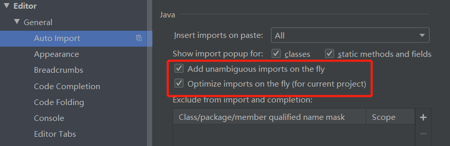
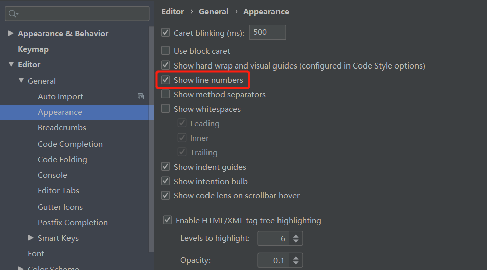

# IDEA通用配置（2019.3.1）

## 安装

推荐ZIP版本

- IDEA占用内存配置
  - idea64.exe.vmoptions ：-Xms -Xmx 设置为符合自己电脑配置的
- 防止Tomcat乱码
  - idea64.exe.vmoptions ：-Dfile.encoding=UTF-8

## 默认设置(Configure-Settings)

安装完成后可以在下方先点击设置，再导入项目防止编码问题

## 项目结构默认设置(Configure-Structure For New Projects)

- 配置默认JDK为自己要使用的JDK

## 外观

1. 字体大小

## 编码

- Editor>File>File Encodings 全部设置为UTF-8

## Maven

- 更改Maven仓库  Build,Execution,Deployment>Build Tools

## 代码提示

Editor > General >Code Completion  设置为All letters

## 自动导包

## 显示行号

